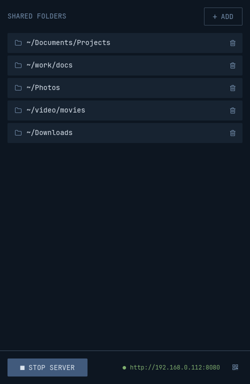

# Porthole

<p align="center">
  
</p>


Porthole is a small desktop app for sharing folders with other devices on your local network. Pick the folders you want to share, start the built-in server, and open the generated link (or scan the QR code) from any phone, tablet, or computer on the same network to browse, download, and upload files — no cloud, no accounts.

## Features

- **Share any number of folders** — add or remove them from the desktop app at any time.
- **Built-in web server** — served over your LAN, browsable from any device with a browser.
- **QR code sharing** — scan it with a phone camera instead of typing an IP address.
- **Upload & download** — the web UI lets connected devices browse folders and transfer files in both directions.
- **No accounts, no cloud** — everything stays on your local network.
- **Cross-platform GUI** — built with [`iced`](https://github.com/iced-rs/iced).

## Installation

Download the archive for your platform from the [latest release](https://github.com/hiksie/porthole/releases/latest), extract it, and run `porthole` (`porthole.exe` on Windows).

| Platform | Download |
| --- | --- |
| Windows (x86_64) | [porthole-x86_64-pc-windows-msvc.zip](https://github.com/hiksie/porthole/releases/latest/download/porthole-x86_64-pc-windows-msvc.zip) |
| macOS (Apple Silicon) | [porthole-aarch64-apple-darwin.tar.xz](https://github.com/hiksie/porthole/releases/latest/download/porthole-aarch64-apple-darwin.tar.xz) |
| macOS (Intel) | [porthole-x86_64-apple-darwin.tar.xz](https://github.com/hiksie/porthole/releases/latest/download/porthole-x86_64-apple-darwin.tar.xz) |
| Linux (x86_64) | [porthole-x86_64-unknown-linux-gnu.tar.xz](https://github.com/hiksie/porthole/releases/latest/download/porthole-x86_64-unknown-linux-gnu.tar.xz) |
| Linux (ARM64) | [porthole-aarch64-unknown-linux-gnu.tar.xz](https://github.com/hiksie/porthole/releases/latest/download/porthole-aarch64-unknown-linux-gnu.tar.xz) |

### macOS

macOS blocks unsigned apps downloaded from the internet. After extracting the archive, remove the quarantine attribute and run the app:

```sh
xattr -dr com.apple.quarantine porthole-aarch64-apple-darwin
./porthole-aarch64-apple-darwin/porthole
```

On Intel Macs, use `porthole-x86_64-apple-darwin` instead.

## Building from source

Requires [Rust](https://www.rust-lang.org/tools/install) 1.93 or newer.

```sh
git clone git@github.com:hiksie/porthole.git
cd porthole
cargo run --release
```

## License

Porthole is licensed under the [MIT License](LICENSE).
